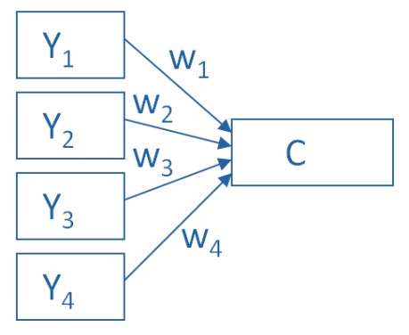
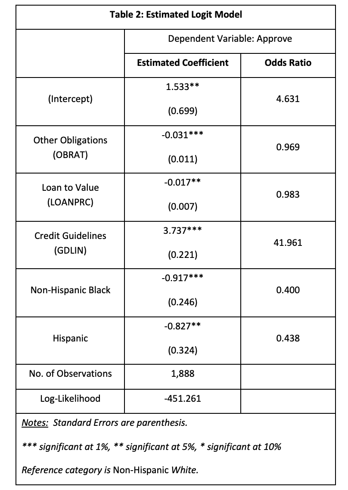
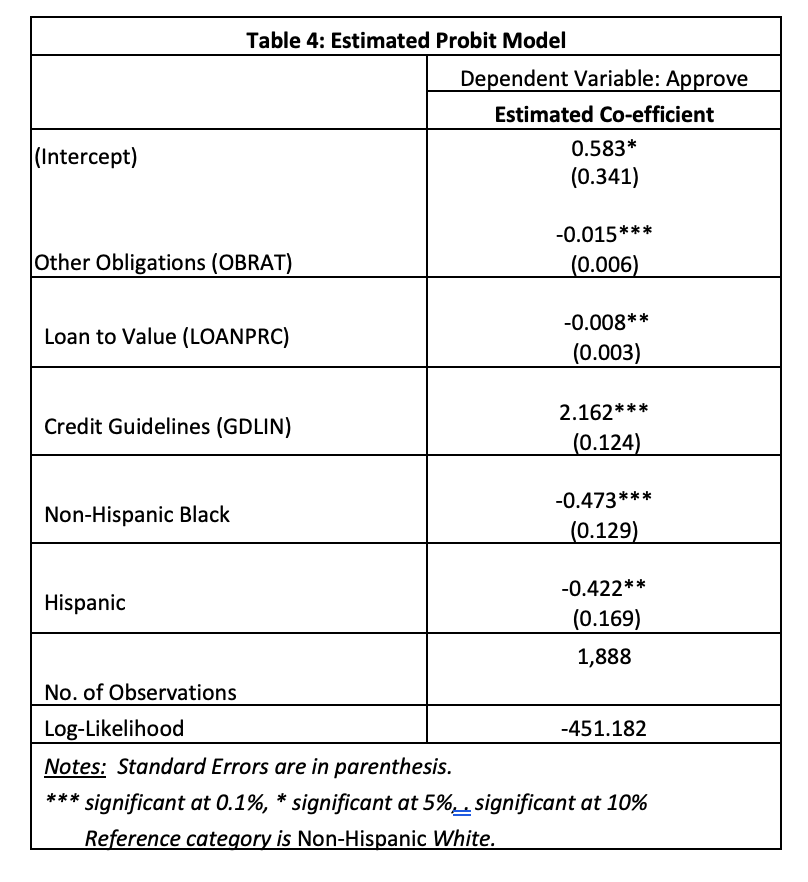

```{r setup, include=FALSE}
knitr::opts_chunk$set(echo = TRUE)
knitr::opts_knit$set(root.dir = rprojroot::find_rstudio_root_file(), message=FALSE, warning=FALSE, echo=FALSE)
library(kableExtra)
library(readr)
library(GGally)
library(psych)
library(factoextra)
library(ggbiplot)
library(CCA)
library(yacca)
library(stats)
library(lavaan)
library("lavaan")
library(semPlot)
library(CCP)
library(psych)
library(tidyverse)
library(FactoMineR)
library(AER)
library(dummies)
library(readxl)
```

## Problem 1

Suppose our multivariate data have `covariance` matrix 

```{r echo=FALSE}
# covariance matrix
S <- matrix(c(5, 0, 0, 0, 9, 0, 0, 0, 8), nrow = 3, ncol = 3, byrow = TRUE )
```

S =
```{r echo=FALSE}
kable(S) %>%
  kable_styling(bootstrap_options = "striped")
```

(a) Find the eigenvalues and eigenvectors of S.

The off-diagonal values are the covariances between variables.

```{r}
res.eig <- eigen(S)
res.eig
```

The eigenvalues of S are $\lambda_1$ = `r res.eig$values[1]`, $\lambda_2$ = `r res.eig$values[2]`, and $\lambda_3$ = `r res.eig$values[3]`.  The eigenvectors of S are:

$a_1$ = `r res.eig$vectors[,1]`

$a_2$ = `r res.eig$vectors[,2]`

$a_3$ = `r res.eig$vectors[,3]`

The sum of the eigenvalues from a correlation matrix will equal the number of variables.  The sum of the eigenvalues will equal `r  sum(res.eig$values)`.

The first two principal components are:

$Z_l$ = `r res.eig$vectors[2,1]` $y_2$ 

$Z_2$ = `r res.eig$vectors[3,2]` $y_3$ 

$Z_3$ = `r res.eig$vectors[1,3]` $y_1$ 

(b) Show the percent of variance explained.

```{r}
res.eig$values/(sum(res.eig$values))
```

The SS loadings = `r res.eig$values[1]`, which is the eigenvalue for the first principal component.  The proportion variance = $\frac{9}{22}$ = `r round(res.eig$values[1] / sum(res.eig$values) * 100, 0)`%.  

The SS loadings = `r res.eig$values[2]`, which is the eigenvalue for the second principal component.  The proportion variance = $\frac{8}{22}$ = `r round(res.eig$values[2] / sum(res.eig$values) * 100, 0)`%.

The SS loadings = `r res.eig$values[3]`, which is the eigenvalue for the third principal component.  The proportion variance = $\frac{5}{22}$ = `r round(res.eig$values[3] / sum(res.eig$values) * 100, 0)`%.

(c) Decide how many components to retain.

Method 1: % of variance

An appropriate threshold percentage should be selected prior to starting the process. If we want to explain at least 50% of variance then we would select PC1 and PC2.  Selecting PC3 is not recomended.

## Problem 2

The correlation matrix given below arises from the scores of 220 boys in six school subjects: (1) French, (2) English, (3) history, (4) arithmetic, (5) algebra, and (6) geometry. Obtain principal component loadings for three factors.

```{r}
# grades correlation matrix
gr <- c(0.44,
        0.41, 0.35,
        0.29, 0.35, 0.16,      
        0.33, 0.32, 0.19, 0.59,      
        0.25, 0.33, 0.18, 0.47, 0.46)  
```


```{r}
grades.cor <- diag(6) / 2
grades.cor[upper.tri(grades.cor)] <- gr
grades.cor <- grades.cor + t(grades.cor)  
rownames(grades.cor) <- colnames(grades.cor) <-
  c("French", "English", "History", "Arithmetic", "Algebra", "Geometry")
```

Step 1: Find correlation matrix R.

R =
```{r echo=FALSE}
kable(grades.cor)  %>%
  kable_styling(bootstrap_options = "striped")
```

```{r}
s <- factanal(covmat = grades.cor, 
              factors = 3, 
              method = "mle", 
              n.obs = 220)
s

loadings(s)
```

Algebra and Arithmetic dominates the first factor.  French dominates the second factor. English weakly dominates the third factor.

```{r}
plot(s$loadings[,1], s$loadings[,2], 
     type = "n", xlab = "Factor 1", 
     ylab = "Factor 2",
     main="Varimax (orthogonal) rotation")

text(s$loadings[,1], s$loadings[,2], 
     rownames(grades.cor), cex = 0.7, xlim = c(-2, 1.5))
```

Math skills such Arithmetic, Algebra and Geometry dominate the first factor. Non-math skills such as French, History and English dominate the second factor.

Step 2: Find the eigenvalue D and eigenvectors C of R.

```{r}
# Then use that correlation matrix to calculate eigenvalues
res.eig <- eigen(grades.cor, symmetric = FALSE)
res.eig
```

Step 3: Find $C_1$ and $D_1$

```{r}
c.1 <- res.eig$vectors[,1:3]
d.1 <- diag(res.eig$values[1:3])
```

$C_1$=

```{r echo=FALSE}
kable(c.1)  %>%
  kable_styling(bootstrap_options = "striped")
```

$D_1$=

```{r echo=FALSE}
kable(d.1)  %>%
  kable_styling(bootstrap_options = "striped")
```

Step 4: Find  $C_1D^{1/2}_1$

```{r}
l <- as.data.frame(c.1 %*% sqrt(d.1))
```

$C_1D^{1/2}_1$=
```{r echo=FALSE}
kable(l, digits = 2)  %>%
  kable_styling(bootstrap_options = "striped")
```

Step 5: Obtain loadings

```{r}
l[,4] <- l[,1]^2 + l[,2]^2 + l[,3]^2
l[,5] <- 1 - l[,4]
```

```{r message=FALSE}
prop <- res.eig$values[1:3]/sum(res.eig$values)
cumprop <- c(prop[1], sum(prop))
cumulative.proportion <- 0
prop <- c()
cumulative <- c()
for (i in res.eig$values) {
  proportion <- i / dim(data)[2]
  cumulative.proportion <- cumulative.proportion + proportion
  prop <- append(prop, proportion)
  cumulative <- append(cumulative, cumulative.proportion)
}
data.frame(cbind(prop, cumulative))

factors <- t(t(res.eig$vectors[,1:3]) * sqrt(res.eig$values[1:3]))
round(factors, 2)

#compute the communality remains the same as in the covariance setting.
h2 <- rowSums(factors^2)
h2

u2 <- 1 - h2
u2

com <- rowSums(factors^2)^2 / rowSums(factors^4)
com

mean(com)
```

```{r echo=FALSE}
l[,6] <- com
```

```{r echo=FALSE}
rownames(l) <-  c("French", "English", "History", "Arithmetic", "Algebra", "Geometry")
kable(l, col.names = c("PC1", "PC2", "PC3", "h2", "u2", "com"), digits = c(2,2,2,2,3,1)) %>%
  kable_styling(bootstrap_options = "striped")
```

```{r}
grades.pc <- principal(grades.cor, nfactors = 3, rotate = 'none', covar = TRUE)
grades.pc
```

<!-- http://datainquisitive.net/wp-content/uploads/2017/01/EFA.html -->
<!-- http://www2.math.uu.se/~thulin/mm/ -->
<!-- http://www.di.fc.ul.pt/~jpn/r/factoranalysis/factoranalysis.html -->

## Problem 3

For the Foodstuff Contents data set below:

(a) Discuss your choice of the number of factors.

```{r message=FALSE}
foodstuff <- read_csv("data/Problem3-dataset.csv") 
foodstuff <- foodstuff %>% remove_rownames %>% column_to_rownames(var="Food")
ggpairs(foodstuff, progress = FALSE)
```

```{r}
s <- factanal(foodstuff, 
              factors = 2, 
              #method = "mle", 
              rotation = "none",
              n.obs = nrow(foodstuff))
s
```

Energy and Fat dominates the first factor.  Protein dominates the second factor.

```{r}
foodstuff.pc <- principal(foodstuff, nfactors = 5, rotate = 'none', covar = FALSE)
foodstuff.pc
```

```{r echo=FALSE}
fa.diagram(foodstuff.pc, digits = 2)
result <- PCA(foodstuff)
```

The first component consist of the average energy and fat content of the food.  The second component consist of the average protein and Iron content of the food.

Method 1: % of variance

An appropriate threshold percentage should be selected prior to starting the process. If we want to explain at least 50% of variance then we would select PC1 and PC2.

Method 2: Kaiser’s criterion

Components with SS loadings > 1. In the foodstuff data, retaining only PC1 and PC2 is recomended. The SS loading for PC3, PC4 and PC5 is < 1.

Method 3: Scree plot

The number of points after point of inflexion. For this plot, retaining PC1 and PC2 is recomended.

```{r}
foodstuff.pca <- prcomp(foodstuff, center = TRUE, scale = TRUE) 
fviz_eig(foodstuff.pca, addlabels = TRUE, ylim = c(0, 80))
```

```{r warning=FALSE, message=FALSE, error=FALSE}
parallel <- fa.parallel(foodstuff, fm = 'pa', fa = 'both', sim=FALSE)
```

Method 1, 2,and 3 recomend that only PC1 and PC2 are retained.  I would only include PC3 if the minimum explained variance % is selected to be at least 80%. Selecting PC4 should be avoided as it explain 99.97% and this could indicate possible overfitting.  None of the methods recomended PC3-PC5 to be retained. 

(b) Obtain principal component loadings.

```{r}
foodstuff.pc$loadings
```

```{r}
#Use R
foodstuff.scaled <- scale(foodstuff, center = TRUE, scale = TRUE)

#Correlation matrix
foodstuff_cor <- cor(foodstuff.scaled)

res.eig <- eigen(foodstuff_cor)
res.eig
```

The sum of the eigenvalues from a correlation matrix will equal the number of variables.  The sum of the eigenvalues will equal 5.  

The SS loadings = `r res.eig$values[1]`, which is the eigenvalue for the first principal component.  The proportion variance = `r round(res.eig$values[1] / sum(res.eig$values) * 100, 0)`%.  

The SS loadings = `r res.eig$values[2]`, which is the eigenvalue for the second principal component.  The proportion variance = `r round(res.eig$values[2] / sum(res.eig$values) * 100, 0)`%.

The SS loadings = `r res.eig$values[3]`, which is the eigenvalue for the third principal component.  The proportion variance = `r round(res.eig$values[3] / sum(res.eig$values) * 100, 0)`%.

The SS loadings = `r res.eig$values[4]`, which is the eigenvalue for the fourth principal component.  The proportion variance = `r round(res.eig$values[4] / sum(res.eig$values) * 100, 0)`%.

The SS loadings = `r res.eig$values[5]`, which is the eigenvalue for the fifth principal component.  The proportion variance = `r round(res.eig$values[5] / sum(res.eig$values) * 100, 0)`%.

The first principal component accounts for the most variable variance (`r res.eig$values[1]` / `r sum(res.eig$values)` = `r round(res.eig$values[1] / sum(res.eig$values) * 100, 1)`%) with the remaining components in lesser and lesser amounts.  This leaves `r 100 - round(res.eig$values[1] / sum(res.eig$values) * 100, 1)`% unexplained variance.  This could be due to another principal component or residual error variance.

The first and second principal component accounts for the most variable variance (`r res.eig$values[1] + res.eig$values[2]` / `r sum(res.eig$values)` = `r round((res.eig$values[1] + res.eig$values[2]) / sum(res.eig$values) * 100, 1)`%) with the remaining components in lesser and lesser amounts.  This leaves `r 100 - round((res.eig$values[1] + res.eig$values[2]) / sum(res.eig$values) * 100, 1)`% unexplained variance.  This could be due to another principal component or residual error variance.

Positively correlated variables are grouped together: fat and energy.

Negatively correlated variables are positioned on opposite sides of the plot origin (opposed quadrants): iron and protein.

The distance between variables and the origine measures the quality of the variables on the factor map. Variables that are away from the origin are well represented on the factor map.


(c) Calculate percent of variance explained for each factor, plot the factor scores using appropriate plot(s), and decide how many components to retain.

```{r warning=FALSE, error=FALSE, message=FALSE}
fa2 <- fa(foodstuff, 2, scores=TRUE, covar = FALSE)
biplot(fa2, labels=rownames(foodstuff))

x <- list() 
x$scores <- factor.scores(foodstuff, fa2)
x$loadings <- fa2$loadings
class(x) <- c('psych','fa')
biplot(x, main="biplot from correlation matrix and factor scores", 
       labels = rownames(foodstuff))
```

Method 1, 2,and 3 recomend that only PC1 and PC2 are retained.

```{r}
foodstuff.pc <- principal(foodstuff, nfactors = 2, rotate = 'none', covar = FALSE)
foodstuff.pc
```

```{r echo=FALSE}
fa.diagram(foodstuff.pc, digits = 2)
```

```{r}
plot(foodstuff.pc, labels=names(foodstuff),  ylim = c(-2,2),  xlim = c(-1.5,1.5))
```

## Problem 4

The data below measures in five variables in comparison of normal patients and diabetics:

x1 : glucose intolerance

x2 : insulin response to oral glucose

x3 : insulin resistance

y1 : relative weight

y2 : fasting plasma glucose

```{r message=FALSE, echo=FALSE}
diabetes <- read_csv("data/Problem4-dataset.csv", col_names = c("Record", "relative weight", "fasting plasma glucose", "glucose intolerance", "insulin response to oral glucose", "insulin resistance"))
```

```{r echo=FALSE}
# diabetes <- as.data.frame(read_table("Software-Files/T3_5_DIABETES.DAT", 
#                                  col_names = c("r",
#                                                "y1", 
#                                                "y2", 
#                                                "x1", 
#                                                "x2",
#                                                "x3"),
#                                  cols(
#                                    r = col_skip(),
#                                    y1 = col_double(),
#                                    y2 = col_double(),
#                                    x1 = col_double(),
#                                    x2 = col_double(),
#                                    x3 = col_double())))
```

```{r echo=FALSE}
x <- diabetes[,4:6]
y <- diabetes[,2:3]

kable(diabetes) %>%
  kable_styling(bootstrap_options = "striped") %>%
  row_spec(0, angle = 90)
```

```{r}
ggpairs(diabetes, progress = FALSE)
```

(a) Find the canonical correlation between (y1, y2) and (x1, x2, x3).

Correlations

```{r}
matcor(y, x)
```

The canonical correlations:

```{r}
# computer canonical correlations
cc1 <- cc(y, x)
# display the canonical correlations
cc1$cor
```

$r_1$ = `r cc1$cor[1]`

$r_2$ = `r cc1$cor[2]` 

The first canonical variate captures the most explained variance, canonical r = `r cc1$cor[1]`.  

The scree graph of canonical correlations:

```{r, echo=FALSE}
barplot(cc1$cor, xlab = "Dimension", ylab = "Canonical correlations", names.arg = 1:2, ylim = c(0,1))
```

Raw canonical coefficients

```{r}
# raw canonical coefficients
cc1[3:4]
```

Compute canonical loadings

```{r}
# compute canonical loadings
cc2 <- comput(y, x, cc1)
# display canonical loadings
cc2[3:6]
```

Table 1: Canonical Coefficients

```{r echo=FALSE}
kable(rbind(cc1[3:4]$xcoef, cc1[3:4]$ycoef), col.names = c("Dimension 1", "Dimension 2")) %>%
  kable_styling(bootstrap_options = "striped")
```

Table 1 presents the canonical coefficients for the first two dimensions across both sets of variables.

(b) Test the significance of each canonical correlation.

Table 2: Tests of Canonical Dimensions

```{r}
# tests of canonical dimensions
rho <- cc1$cor
## Define number of observations, 
n <- dim(y)[1]
# number of variables in first set
p <- length(y)
# number of variables in the second set
q <- length(x)

## Calculate p-values using the F-approximations of different test statistics:
res <- p.asym(rho, n, p, q, tstat = "Wilks")
```

Plot the F-approximation for Wilks' Lambda, considering 2 or 1 canonical correlation(s):

```{r echo=FALSE}
## Plot the F-approximation for Wilks' Lambda, considering 2, or 1 canonical correlation(s):
plt.asym(res, rhostart=1)
plt.asym(res, rhostart=2)
```

$H_0$: there is no (linear) relationship between the y's and the x's - all canonical correlations $r_1$, $r_2$ are non-significant.

$H_1$: there is (linear) relationship between the y's and the x's
at least one canonical correlations $r_1$, $r_2$ is significant.

We fail to reject the null hypothesis in favor of the alternative.  This implies that $r^2_1$ and $r^2_2$ is not significantly different from zero.

We conclude that $r_1$ = `r cc1$cor[1]` (F =`r res$approx[1]`) is not significant since the p-value (`r res$p.value[1]`) > 0.05

We conclude that $r_2$ = `r cc1$cor[2]` (F =`r res$approx[2]`) is not significant since the p-value (`r res$p.value[2]`) > 0.05

Tests of dimensionality for the canonical correlation analysis, as shown in Table 2, indicate that the two canonical dimensions are not statistically significant at the 0.05 level. Dimension 1 has a canonical correlation of `r cc1$cor[1]` between the sets of variables, while for dimension 2 the canonical correlation was much lower at `r cc1$cor[2]`

## Problem 5

The data consists of mental ability test scores of seventh- and eighth-grade children from two different schools (Pasteur and Grant-White). In our version of the dataset, only 9 out of the original 26 tests are included. A CFA model that is often proposed for these 9 variables consists of three latent variables (or factors), each with three indicators:

- a visual factor measured by 3 variables: x1 and x2

- a textual factor measured by 4 variables: x3, x4, x5 and x6

- a speed factor measured by 3 variables: x7, x8 and x9

- a visual factor and a textual factor have zero correlation

(a) Please draw a figure contains a graphical representation of the three-factor model.

x1: Visual perception

x2: Cubes

x3: Lozenges

x4: paragraph comprehension

x5: Sentence completion

x6: Word meaning

x7: Speeded addition

x8: Speeded counting of dots

x9: Speeded discrimination straight and curved capitals


```{r}
# specify the model
HS.model <- ' Visual  =~ x1 + x2      
              Textual =~ x3 + x4 + x5 + x6
              Speed   =~ x7 + x8 + x9 
              Visual ~~ 0 * Textual'

fit <- lavaan::cfa(HS.model, data=HolzingerSwineford1939)
summary(fit)
semPaths(fit) #, title = FALSE, curvePivot = TRUE)
```

(b) Please write out the corresponding syntax for specifying this model.

Visual  =~ x1 + x2

Textual =~ x3 + x4 + x5 + x6

Speed   =~ x7 + x8 + x9 

Visual ~~ 0 * Textual

## Problem 6

Make a conclusion for this class DA 410, make sure you include the following aspects:

(a) How many models you have learnt, use 3 to 5 sentences to explain each of them.

### Multivariate Analysis of Variance

MANOVA was used to tests for the difference in two or more vectors of means.  For this model, total of the ith sample, overall total, and mean of the ith sample is calculated.  These calculations are then used to create a model for each observation vector.  There are four test statistic used to test:  Wilks, Roy, Pillai and Lawley-Hotelling.  MANOVA can be conducted as one-way or as two-way. The number of factor variables involved distinguish a one-way MANOVA from a two-way MANOVA. 

### Discriminant Analysis

Discriminant Analysis is used to perform a multivariate test of differences between groups and can also be used to determine the minimum number of dimensions needed to describe the differences.
LDA: The mean and the variance of the variable for each class is calculated for every single input variable (x). For multiple variables, the mean and the covariance matrix is calculated over the multivariate Gaussian.  These statistical properties are estimated are used in the LDA equation to make predictions. QDA is an extension of LDA.

### K-Nearest neighbor

For K-Nearest neighbor each new instance (x) is predicted by searching through the entire training set for the K most similar instances (neighbors) and summarizing the output variable for those K instances. To predict iterate from 1 to total number of training data points and calculate the distance (such as Euclidean) between them. Then sort the calculated distances in ascending order based on distance values, get top k rows from the sorted array, determine the most frequent class of the rows and then return the predicted class.

### Canonical correlation analysis

Canonical correlation analysis is a method for exploring the relationships between two multivariate sets of variables (vectors).  A correlation matrix is computed and the following information is extracted: 

- Rxx: The correlations among the X variables.

- Ryy: The correlations among the Y variables.

- Rxy: The correlations between the X and Y variables.

- Ryx: The correlations between the Y and X variables. 

The Canonical correlation coefficients are defined using the singular value decomposition of a matrix C.

### Principal Component Analysis 

Principal Component Analysis is a data reduction methods that identify the variance in variables in a smaller set.  Find the covariance matrix S (covariance matrix) or R (correlation matrix) to compute eigenvalues and eigenvectors.  Determine the total variance for each principal components. Determine components to keep based on total variance explained, keep only the components whose eigenvalues is at least greater than the average eigenvalue and the average sample variance of the original variables.

### Factor Analysis

Factor Analysis is a data reduction methods that identify the variance in variables in a smaller set.

Exploratory Factor Analysis main goals are to explore the underlying theoretical structure and dentify the structure of the relationship between the variable and the respondent.  The are two methods: Principle component actor analysis and Common factor analysis.  The five steps are:

1- Find correlation matrix

2- Find eigenvalues and eigenvectors.

3 - Find $C_1$ and $D_1$

4 - Find $C_1D^{1/2}_1$

5- Find component loading.

Confirmatory Factor Analysis is used to verify the factor structure of a set of observed variables (i.e. test the model).  The model defines the latent variable with set of observed (manifest/indicators) variables.  CFA test whether the indicators that have been classified previously into a group will be consistent.  The initial assumption is that indicators fit into a certain latent variables.

### Cluster Analysis

K-means 

1- Each data point is assigned to its nearest centroid, based on the squared Euclidean distance.

2- The centroids are recomputed.

3- Iterates between steps 1 and 2 until a stopping criteria is met (no data points change clusters, the sum of the distances is minimized, or some maximum number of iterations is reached).


(b) Which one really impressed you when you learnt and why

While I had been previously exposed to PCA as a data reduction methods, I was really impressed with Factor Analysis and Canonical Correlation Analysis.  I was originally confused at first specially given that FA has different methods to extract factors: principal component analysis, common factor analysis (SEM), image factoring (OLS), maximum likelihood method and others. Factor analyis can be Exploratory factor analysis or Confirmatory factor analysis.

The assumption in exploratory factor analysis (EFA) is that any indicator or variable may be associated with any factor.  Confirmatory factor analysis (CFA) is used to determine the factor and factor loading of measured variables.  The analysis is based on a prior theory and one of the goals is to confirm it. CFA assumes that each factor is associated with a specified subset of measured variables.  

(c) Which one is your favorite one and why

We did not spend too much time on K-means, but his is one of my favorite modeling techniques.  This method is simple to even a novice can easily understand.  The K-means clustering algorithm can be used to find groups which have not been explicitly labeled in the data. This is a versatile algorithm that can be used for in the following business cases:

- Inventory categorization

- Detecting bots or anomalies

- Behavioral segmentation

- Sorting sensor measurements
f
(d) Select two models out, make a comparison. Show the differences and similarities between them. 

I will discuss the fundamental difference between Principal Component Analysis (PCA) and Factor Analysis (FA). Both are data reduction methods that identify the variance in variables in a smaller set. The steps to conducted PCA or FA are similar: extraction, interpretation, rotation, choosing the number of components/factors.

PCA is a linear combination of variables. Factor Analysis is a measurement model of a latent variable. PCA creates one or more components variables from a larger set of measured variables by using a linear combination (weighted average) of a set of variables. This method seeks to find the optimal number of components and weights.  The relationships between C and each Y are weighted.

In this example, 4 measured ($Y_1, Y_2, Y_3, and Y_4$) variables are combined into a single component (C).  The direction of the arrows shows that Y variables contribute to the component variable. The weights ($w1, w_2, w_3, and w_4$) shows how Y variables contribute more than others.



$C = w_1(Y_1) + w_2(Y_2) + w_3(Y_3) + w_4(Y_4)$

Factor Analysis approaches data reduction by modeling the measurement of a latent variable. Latent variable cannot be directly measured with a single variable (such as social anxiety) but can be seen through the relationships it causes in a set of Y variables.

Measuring social anxiety is not possible but social anxiety can be measured as high or low by ansering question such as “I am uncomfortable in large groups” and “I get nervous talking with strangers.” Those experiencing high social anxiety will most likely answer similarly to others with high social anxiety. Likewise, those experiencing low social anxiety will most likely answer similarly to others with low social anxiety.

In this example F, the latent factor, is causing the responses on the four measured Y variables.  The arrows go in the opposite direction from PCA. The relationships between F and each Y are weighted. During factor analysis the optimal weights are identified. The u's are the set of error terms which measures variance in each Y that is unexplained by the factor.


$Y_1 = b_1 * F + u_1$

$Y_2 = b_2 * F + u_2$

$Y_3 = b_3 * F + u_3$

$Y_4 = b_4 * F + u_4$

(e) If you will build up a project to solve some real problem using one of them, which one you would like to you, and what kind of project you will like to build. (200 words)

Currently I am analazying the Boston HMDA Data to create a mortgage lending decisson model.  The Boston HMDA data set was collected by researchers at the Federal Reserve Bank of Boston. The data set combines information from mortgage applications and a follow-up survey of the banks/lending institutions that received these mortgage applications. The data constains information on mortgage applications made in 1990 in the greater Boston metropolitan area. The full data set has 2925 observations, consisting of all mortgage applications by blacks and Hispanics and a random sample of mortgage applications by whites. My goal is to create both logit and probit models to determine if lending institution showed bias toward minorities (Black and Hispanics).  I performed EDA to select the variables to include in my model but I would like to go back and perform principal component analysis as a way to reduce dimensionality.  This is a practical and real world example of a model that I could build in the near future.

```{r}
#using HMDA from AER package
data(HMDA)
#create a dummy data frame
HMDA <- dummy.data.frame(HMDA, names = c("phist",
                                         "selfemp", "insurance",
                                         "condomin","afam", "single", "hschool"))

HMDA$chist <- as.integer(HMDA$chist)
HMDA$mhist <- as.integer(HMDA$mhist)

#principal component analysis
prin_comp <- prcomp(HMDA[,-1])
prin_comp
fviz_eig(prin_comp, addlabels = TRUE, ylim = c(0, 80))
fviz_pca_var(prin_comp, col.var = "contrib",
             gradient.cols = c("#00AFBB", "#E7B800", "#FC4E07"))
```

```{r echo=FALSE}
HMDA <- read_excel('code/MLD Data File.xls') %>% filter(MALE != ".") %>% filter(GDLIN != "666") %>% filter(MARRIED != ".")
HMDA$MARRIED <- as.integer(HMDA$MARRIED)
HMDA$MALE <- as.integer(HMDA$MALE)
```

```{r}
prin_comp <- prcomp(HMDA[,-7]) 
prin_comp
fviz_eig(prin_comp, addlabels = TRUE, ylim = c(0, 80))
fviz_pca_var(prin_comp, col.var = "contrib",
             gradient.cols = c("#00AFBB", "#E7B800", "#FC4E07"))
```

The logit and probit models indicate that approval rates are higher for Whites than for  Hispanic and Black applicants holding constant the loan to value, other obligations and creditworthiness.





Reference:

http://wise.xmu.edu.cn/course/gecon/hmda.pdf

Mortgage Lending in Boston: Interpreting HMDA Data,” American Economic Review, 1996, pp. 25 – 53
